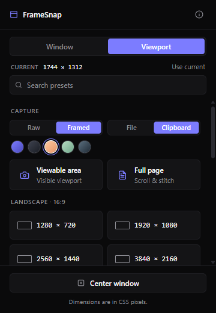

# FrameSnap

A Manifest V3 Chromium extension that combines two flows developers actually
use:

1. **Window resizing** — snap the active browser window to preset
   dimensions for testing layouts, screenshots, and video recording.
2. **Screenshot capture** — grab the visible viewport or the entire page
   (including content beyond the scroll), optionally framed on a gradient
   background, then save to disk or copy straight to the clipboard.

Click the toolbar icon → click a preset or capture button → done.

<p align="center">
  
</p>

## Features

### Window resizing
- **Window vs Viewport mode** — resize the outer window, or resize so the
  inner viewport hits exact target dimensions. The chrome offset is read
  from the active tab and cached, so subsequent captures still work on
  `chrome://` and other non-injectable pages.
- **Built-in presets** — Landscape (16:9), Portrait (9:16), Standard (4:3),
  Square (1:1), and common mobile devices.
- **Custom dimensions** with positive-integer validation up to 8000 × 8000.
- **Saved presets** — name and store custom sizes; persist across browser
  restarts. Each saved card has **edit** (pencil) and **delete** (×)
  buttons on hover, and saved presets can be **dragged to reorder**.
- **Search / filter palette** — type to filter built-in and saved presets
  by dimension, label, or aspect-ratio family. `/` focuses the box from
  anywhere; `Esc` clears.
- **Active-preset highlight** — the matching preset is ringed in the
  accent colour when the current window is at those dimensions
  (±1 px tolerance for HiDPI rounding).
- **Live current-dimensions display** with a `Use current` link that
  fills the custom inputs.
- **Center on display** — recenters the current window on the active
  monitor (multi-monitor aware via `chrome.system.display`).
- **Clamp warning** — when a target exceeds the active display, the
  window is clamped to the work area and a warning toast appears instead
  of failing silently.

### Screenshot capture
- **Viewable area** — single-click PNG of the visible viewport.
- **Full page** — captures the entire scrollable page using Chrome's
  debugger protocol (`Page.captureScreenshot` with
  `captureBeyondViewport: true`), the same call DevTools' "Capture full
  size screenshot" command runs. Sticky/fixed elements appear once at the
  top of the captured image rather than tiling repeatedly through it
  (handled via `Emulation.setDeviceMetricsOverride`).
- **Lazy-load handling** — for pages that load on scroll (LinkedIn home,
  Twitter, etc.), the extension drives the page to load deferred content
  before capturing, by combining `Runtime.evaluate` `scrollTo` with
  `Input.synthesizeScrollGesture` (a trusted user-style scroll gesture
  routed through the debugger). Stops when the page stops growing or
  hits the 16,384 px GPU canvas cap.
- **Framed output** — composite the screenshot onto a gradient background
  with rounded corners and a subtle drop shadow. Five curated gradient
  presets: Indigo, Graphite, Apricot, Sage, Storm. Padding adapts so even
  tall full-page captures stay within the GPU canvas limit.
- **Clipboard or file** — toggle the output between download (PNG file in
  the Downloads folder) and clipboard (paste straight into Slack, Notion,
  or anywhere else). Falls back to file save with a warning toast if the
  clipboard write throws.

## Install (unpacked, for development)

1. Clone or download this repository.
2. Open `chrome://extensions` (or `brave://extensions`, etc.) in your
   Chromium-based browser.
3. Enable **Developer mode** (toggle, top right).
4. Click **Load unpacked** and select the `FrameSnap/` folder.
5. Pin the FrameSnap icon from the puzzle-piece menu so it's always visible.

No `npm install`, no build step. The folder you load is the extension.

## Permissions

- `windows` — read and update the active browser window's size and position.
- `storage` — persist saved presets, last-used mode, frame/output
  preferences, and the cached chrome offset locally.
- `system.display` — read display bounds and work-area dimensions for
  clamping and centering.
- `scripting` + `activeTab` — read viewport offsets (`outerWidth -
  innerWidth`, `outerHeight - innerHeight`) from the active tab so
  Viewport mode can account for the browser chrome.
- `debugger` — required for full-page screenshot capture. Used to attach
  to the active tab, run a single `Page.captureScreenshot` call, then
  detach.
- `clipboardWrite` — write captured images to the system clipboard when
  the Clipboard output option is selected.

No host permissions are requested. No network calls are made. All state
stays in `chrome.storage.local`.

### A note on the debugger banner

While a full-page screenshot is in progress (typically 1–3 seconds, longer
on infinite-scroll feeds while the load loop runs), Chromium shows a
yellow infobar across the top of the active tab:

> *This tab is being controlled by automated test software.*

This is the standard Chromium signal whenever an extension uses the
debugger API, and there is no way to suppress it. The banner disappears
the moment the capture finishes and the debugger detaches.

## A note on dimensions

All values are **CSS pixels**. On a high-DPI display, the physical pixel
count differs by `window.devicePixelRatio`. A "1920 × 1080" viewport on a
2× display occupies 3840 × 2160 physical pixels. Capture output respects
the device pixel ratio, so a viewable-area capture at a 1920 × 1080
viewport on a 2× display produces a 3840 × 2160 PNG.

## File layout

```
FrameSnap/
├── manifest.json          MV3 manifest
├── popup.html             Popup markup
├── popup.css              Popup styles (dark, dense)
├── popup.js               Popup logic — resize, capture, framing, persistence
├── background.js          Minimal service worker (reserved for future use)
├── icons/                 16/32/48/128 px PNGs
├── docs/                  Screenshots and other repo assets
└── README.md
```

## Browser support

Chrome / Edge / Brave / Arc / any Chromium 100+. Firefox is not yet
supported (the manifest needs adjusting and `chrome.system.display`,
`chrome.debugger`, `Page.captureScreenshot`, and
`Input.synthesizeScrollGesture` are Chromium-specific).

## License

See `LICENSE`.
